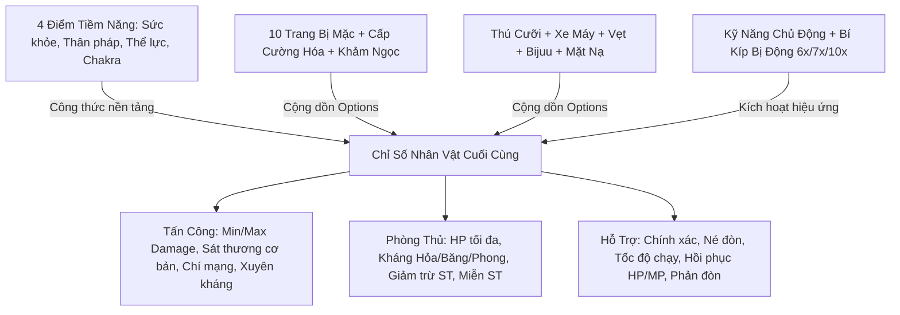

# TÀI LIỆU TOÀN DIỆN VỀ CHỈ SỐ NHÂN VẬT & THUỘC TÍNH TRANG BỊ NSO

> **Phiên bản máy chủ**: NSO Ninja School Private 2026  
> **Áp dụng cho**: Hệ thống 6 Môn Phái (Kiếm, Tiêu, Kunai, Cung, Đao, Quạt) & Toàn bộ Trang Bị, Thú Cưỡi, Khảm Ngọc  
> **Cơ sở dữ liệu**: MariaDB / MySQL (`nso_test`)  
> **Mã nguồn tính toán**: `com.nsoz.ability.AbilityFromEquip.java` & `com.nsoz.model.Char.java`

---

## MỤC LỤC
1. [Sơ Đồ & Cơ Chế Tính Toán Chỉ Số](#1-sơ-đồ--cơ-chế-tính-toán-chỉ-số)
2. [Chi Tiết 4 Điểm Tiềm Năng Gốc](#2-chi-tiết-4-điểm-tiềm-năng-gốc)
3. [Chi Tiết Các Chỉ Số Chiến Đấu Của Nhân Vật](#3-chi-tiết-các-chỉ-số-chiến-đấu-của-nhân-vật)
   - [3.1. Nhóm Tấn Công & Sát Thương](#31-nhóm-tấn-công--sát-thương)
   - [3.2. Nhóm Sinh Lực & Phòng Ngự](#32-nhóm-sinh-lực--phòng-ngự)
   - [3.3. Nhóm Cơ Động, Khống Chế & Phản Đòn](#33-nhóm-cơ-động-khống-chế--phản-đòn)
4. [Bảng Tra Cứu Toàn Bộ Thuộc Tính Trang Bị (ItemOption ID 0 - 161)](#4-bảng-tra-cứu-toàn-bộ-thuộc-tính-trang-bị-itemoption-id-0---161)
   - [4.1. Thuộc Tính Cơ Bản (Công, Thủ, HP, MP, Kháng, Né, Chính Xác)](#41-thuộc-tính-cơ-bản)
   - [4.2. Thuộc Tính Kích Hoạt Cường Hóa (+4, +8, +12, +14, +16)](#42-thuộc-tính-kích-hoạt-cường-hóa)
   - [4.3. Thuộc Tính Thú Cưỡi & Pet (Mount System)](#43-thuộc-tính-thú-cưỡi--pet)
   - [4.4. Thuộc Tính Khảm Ngọc (Gem System)](#44-thuộc-tính-khảm-ngọc)
   - [4.5. Thuộc Tính Cao Cấp & Kỹ Năng Ẩn Đặc Biệt](#45-thuộc-tính-cao-cấp--kỹ-năng-ẩn-đặc-biệt)
5. [Hướng Dẫn Chỉnh Sửa & Câu Lệnh SQL Mẫu](#5-hướng-dẫn-chỉnh-sửa--câu-lệnh-sql-mẫu)

---

## 1. SƠ ĐỒ & CƠ CHẾ TÍNH TOÁN CHỈ SỐ

Mọi thuộc tính chiến đấu của nhân vật được Server tổng hợp theo thời gian thực từ 4 nguồn chính:



---

## 2. CHI TIẾT 4 ĐIỂM TIỀM NĂNG GỐC

Mỗi khi lên cấp hoặc dùng sách tiềm năng, nhân vật nhận được điểm tiềm năng tự do để phân phối vào 4 nhánh:

| Chỉ Số Tiềm Năng | Tên Gọi | Tác Dụng Cốt Lõi | Môn Phái Ưu Tiên |
| :--- | :--- | :--- | :--- |
| **Sức Khỏe** (`potential[0]`) | Ngoại công / Sức mạnh | Tăng **Tấn công Ngoại công** (Sát thương vật lý cận chiến/viễn chiến). | Kiếm, Tiêu, Cung, Đao |
| **Thân Pháp** (`potential[1]`) | Nhanh nhẹn / Độ khéo | Tăng mạnh **Né đòn (`miss`)** và **Chính xác (`exactly`)**. | Cả 6 phái (rất quan trọng trong PvP) |
| **Thể Lực** (`potential[2]`) | Thể chất / Sinh mệnh | Tăng **Máu tối đa (`maxHP`)**. Mỗi 1 điểm Thể lực = **+10 HP cơ bản**. | Mọi phái (tăng độ chống chịu) |
| **Chakra** (`potential[3]`) | Nội công / Trí lực | Tăng **Tấn công Nội công** và **MP tối đa (`maxMP`)**. 1 điểm = **+10 MP cơ bản**. | Kunai, Quạt |

---

## 3. CHI TIẾT CÁC CHỈ SỐ CHIẾN ĐẤU CỦA NHÂN VẬT

Dưới đây là các công thức giải mã trực tiếp từ mã nguồn [`AbilityFromEquip.java`](file:///e:/TT/SETUP_LOCAL/SRC_GAME/src/main/java/com/nsoz/ability/AbilityFromEquip.java) của Server:

### 3.1. Nhóm Tấn Công & Sát Thương

* **`basicAttack` (Tấn công cơ bản)**: Lực đánh từ điểm tiềm năng kết hợp với chỉ số sát thương thuần của vũ khí.
* **`damage` (Tấn công tối đa)** & **`damage2` (Tấn công tối thiểu)**:
  * Là khoảng sát thương đầu ra thực tế khi nhân vật tung đòn đánh.
  * **Công thức**:
    $$\text{damage} = \text{basicAttack} + \text{Công ngoại/nội} + \text{Hỏa/Băng/Phong} + (\text{Tiềm năng} \times \% \text{Vật công}) + \text{Sát thương Skill}$$
    $$\text{damage2} = \text{damage} - \frac{\text{damage}}{10} \quad (\text{Dao động } 90\% - 100\%)$$
* **`fatal` (Tỉ lệ chí mạng)**: Xác suất nổ đòn đánh chí mạng (hiển thị số vàng nhảy damage lớn).
* **`percentFatalDame` (Sát thương chí mạng %)**: Tăng uy lực phần trăm khi nổ chí mạng (gốc 100% + % cộng thêm từ Option ID 39, 67).
* **`fatalDame` (Sát thương chí mạng cố định)**: Điểm cộng thẳng trực tiếp vào sát thương chí mạng (Option ID 105).
* **`Hỏa công / Băng sát / Phong lôi`**:
  * **Hỏa công**: Gây thiêu đốt, trừ máu theo từng giây.
  * **Băng sát**: Gây hiệu ứng làm chậm tốc độ chạy hoặc đóng băng bất động.
  * **Phong lôi**: Gây hiệu ứng choáng váng (Stun), ngắt chiêu của đối phương.
* **`Bỏ qua kháng đối phương (%)` (Option ID 101)**: Sát thương xuyên thủng giáp kháng nguyên tố của mục tiêu.
* **`Sát thương chuẩn` (Option ID 113)**: Đòn đánh chuẩn không thể bị giảm trừ bởi giáp hay kháng.

---

### 3.2. Nhóm Sinh Lực & Phòng Ngự

* **`maxHP` (Lượng máu tối đa)**:
  $$\text{maxHP} = \left[(\text{Thể lực} \times 10) \times (1 + \sum \% \text{HP trang bị}) + \sum \text{HP cộng thẳng}\right] \times (1 + \% \text{HP sau mặc đồ})$$
* **`maxMP` (Lượng Chakra tối đa)**:
  $$\text{maxMP} = (\text{Chakra} \times 10) \times (1 + \sum \% \text{MP trang bị}) + \sum \text{MP cộng thẳng}$$
* **`resFire` (Kháng Hỏa), `resIce` (Kháng Băng), `resWind` (Kháng Phong)**: Giảm trực tiếp lượng sát thương thuộc tính hệ tương ứng nhận vào.
* **`Kháng tất cả` (Option ID 20, 36, 81, 118)**: Tăng đồng thời cả 3 chỉ số Kháng Hỏa, Kháng Băng và Kháng Phong.
* **`dameDown` (Giảm trừ sát thương)**: Trừ thẳng một lượng sát thương cố định nhận vào từ mỗi đòn đánh của địch.
* **`Miễn giảm sát thương (%)` (Option ID 98, 136)**: Giảm trực tiếp theo tỷ lệ phần trăm toàn bộ sát thương gánh chịu.

---

### 3.3. Nhóm Cơ Động, Khống Chế & Phản Đòn

* **`miss` (Né đòn)**: Khả năng né tránh hoàn toàn đòn tấn công của đối thủ (hiển thị chữ *Hụt*).
* **`exactly` (Chính xác)**: Tăng khả năng đánh trúng mục tiêu có chỉ số Né đòn cao.
* **`reactDame` (Phản đòn cận chiến)**: Phản lại một lượng sát thương trực tiếp cho kẻ tấn công khi bị đánh cận chiến.
* **`speed` (Tốc độ di chuyển)**: Mặc định là `5`. Khi cưỡi thú được cộng thêm `+2` và cộng thêm từ dòng chỉ số trên giày/thú cưỡi.
* **`Giảm trừ thời gian Bỏng / Đóng băng / Choáng`**: Giảm thời gian nhân vật bị dính các hiệu ứng khống chế bất lợi.

---

## 4. BẢNG TRA CỨU TOÀN BỘ THUỘC TÍNH TRANG BỊ (`ItemOption ID`)

Toàn bộ 162 mã thuộc tính trong cơ sở dữ liệu `item_option`:

### 4.1. Thuộc Tính Cơ Bản

| Option ID | Tên Thuộc Tính | Ý Nghĩa / Cách Tính |
| :---: | :--- | :--- |
| **0** | `Tấn công ngoại: +#` | Tăng điểm tấn công vật lý |
| **1** | `Tấn công nội: +#` | Tăng điểm tấn công phép |
| **2, 11** | `Kháng hỏa: +#` | Điểm kháng hệ Lửa |
| **3, 12** | `Kháng băng: +#` | Điểm kháng hệ Nước/Băng |
| **4, 13** | `Kháng phong: +#` | Điểm kháng hệ Gió/Sét |
| **5, 17** | `Né đòn: +#` | Tăng chỉ số né tránh |
| **6** | `HP tối đa: +#` | Cộng thẳng lượng máu tối đa |
| **7, 19** | `MP tối đa: +#` | Cộng thẳng lượng mana |
| **8** | `Vật công ngoại: +#%` | Tăng % công lực ngoại |
| **9** | `Vật công nội: +#%` | Tăng % công lực nội |
| **10, 18** | `Chính xác: +#` | Tăng khả năng đánh trúng |
| **14** | `Chí mạng: +#` | Tăng tỉ lệ đòn chí mạng |
| **15** | `Phản đòn cận chiến: +#` | Phản sát thương khi bị đánh gần |
| **16** | `Tốc độ di chuyển: +#%` | Tăng tốc độ chạy |
| **20** | `Kháng tất cả: +#` | Tăng đồng thời Kháng Hỏa, Băng, Phong |
| **21** | `Hỏa công ngoại: +#` | Sát thương hệ Lửa (Ngoại) |
| **22** | `Hỏa công nội: +#` | Sát thương hệ Lửa (Nội) |
| **23** | `Băng sát ngoại: +#` | Sát thương hệ Băng (Ngoại) |
| **24** | `Băng sát nội: +#` | Sát thương hệ Băng (Nội) |
| **25** | `Phong lôi ngoại: +#` | Sát thương hệ Phong/Sét (Ngoại) |
| **26** | `Phong lôi nội: +#` | Sát thương hệ Phong/Sét (Nội) |
| **47** | `Giảm trừ sát thương: +#` | Trừ sát thương cố định nhận vào |
| **57** | `+# điểm tiềm năng cho tất cả` | Tăng cả 4 điểm tiềm năng gốc |
| **58** | `Cộng thêm tiềm năng: +#%` | Tăng % tổng điểm tiềm năng |
| **59** | `Cho phép tăng thêm điểm kỹ năng 6x: +# điểm` | Tăng cấp tối đa của skill 6x |
| **63** | `Giảm sát thương bởi người chơi khác: +#%` | Giảm sát thương nhận vào trong PvP |

---

### 4.2. Thuộc Tính Kích Hoạt Cường Hóa

*Các dòng chỉ số này chỉ có tác dụng khi trang bị đạt cấp cường hóa (+4, +8, +12, +14, +16):*

| Option ID | Tên Dòng Thuộc Tính Kích Hoạt | Cấp Cường Hóa Kích Hoạt |
| :---: | :--- | :---: |
| **27** | `(+4) Mỗi 5 giây phục hồi MP: #` | **+4** |
| **30** | `(+4) Mỗi 5 giây phục hồi HP: #` | **+4** |
| **60** | `(+4) Tỉ lệ MP tối đa: +#%` | **+4** |
| **28** | `(+8) Tỉ lệ MP tối đa: +#%` | **+8** |
| **31, 61** | `(+8) Tỉ lệ HP tối đa: +#%` | **+8** |
| **37** | `(+8) Chí mạng: +#` | **+8** |
| **29** | `(+12) MP tối đa: +#` | **+12** |
| **32** | `(+12) HP tối đa: +#` | **+12** |
| **38** | `(+12) Tấn công cơ bản của vũ khí: +#` | **+12** |
| **62** | `(+12) Né đòn: +#` | **+12** |
| **33** | `(+14) Kháng hỏa: +#` | **+14** |
| **34** | `(+14) Kháng băng: +#` | **+14** |
| **35** | `(+14) Kháng phong: +#` | **+14** |
| **36** | `(+14) Kháng tất cả: +#` | **+14** |
| **39** | `(+14) Tấn công khi đánh chí mạng: +#%` | **+14** |
| **40** | `(+16) Giảm trừ thời gian bị bỏng: -#` | **+16** |
| **41** | `(+16) Giảm trừ thời gian bị đóng băng: -#` | **+16** |
| **42** | `(+16) Giảm trừ thời gian bị choáng: -#` | **+16** |
| **43** | `(+16) Thời gian bị bỏng: +#` | **+16** |
| **44** | `(+16) Thời gian bị đóng băng: +#` | **+16** |
| **45** | `(+16) Thời gian bị choáng: +#` | **+16** |
| **46** | `(+16) Chịu sát thương khi bị chí mạng: -#%` | **+16** |
| **48** | `(+16) Giảm trừ sát thương bởi hỏa hệ: +#` | **+16** |
| **49** | `(+16) Giảm trừ sát thương bởi băng hệ: +#` | **+16** |
| **50** | `(+16) Giảm trừ sát thương bởi phong hệ: +#` | **+16** |
| **51** | `(+16) Tăng sát thương bởi hỏa hệ: +#` | **+16** |
| **52** | `(+16) Tăng sát thương bởi băng hệ: +#` | **+16** |
| **53** | `(+16) Tăng sát thương bởi phong hệ: +#` | **+16** |
| **54** | `(+16) Sát thương đánh hệ hỏa: +#%` | **+16** |
| **55** | `(+16) Sát thương đánh hệ băng: +#%` | **+16** |
| **56** | `(+16) Sát thương đánh hệ phong: +#%` | **+16** |

---

### 4.3. Thuộc Tính Thú Cưỡi & Pet

| Option ID | Tên Thuộc Tính | Ý Nghĩa |
| :---: | :--- | :--- |
| **65** | `Kinh nghiệm: #/1000` | Điểm EXP nâng cấp thú cưỡi |
| **66** | `Sinh lực: #/1000` | Thể lực của thú cưỡi |
| **67** | `Tấn công khi đánh chí mạng: #%` | Tăng % sát thương chí mạng |
| **68** | `Né đòn: +#` | Thú cưỡi hỗ trợ né tránh |
| **69** | `Chí mạng: +#` | Thú cưỡi hỗ trợ tỉ lệ chí mạng |
| **70, 71, 72**| `Kháng hỏa / Kháng băng / Kháng phong: +#` | Thú cưỡi hỗ trợ kháng nguyên tố |
| **73** | `Tấn công: #` | Thú cưỡi cộng thẳng sát thương |
| **74** | `Chịu sát thương cho chủ: +#` | Chuyển một phần sát thương của chủ sang thú |
| **75** | `Tăng chính xác cho chủ: +#` | Thú cưỡi hỗ trợ chính xác |
| **76** | `Tăng tấn công cho chủ: +#` | Thú cưỡi hỗ trợ lực chiến |
| **77** | `Tăng max HP cho chủ: +#` | Thú cưỡi hỗ trợ lượng máu |
| **78** | `Tăng né tránh cho chủ: +#` | Thú cưỡi hỗ trợ né đòn |
| **79, 121** | `Kháng sát thương chí mạng: #%` | Giảm % sát thương khi bị đối phương nổ chí mạng |
| **80, 124** | `Giảm trừ sát thương: #` | Trừ sát thương cố định |
| **81, 118** | `Kháng tất cả: +#` | Kháng cả 3 hệ Hỏa, Băng, Phong |
| **82, 125** | `HP tối đa: #` | Tăng máu tối đa |
| **83, 117** | `MP tối đa: +#` | Tăng mana tối đa |
| **84, 115** | `Né đòn: +#` | Tăng né tránh |
| **85** | `Độ tinh luyện: #` | Cấp độ tinh luyện trang bị thú |
| **86, 116** | `Chính xác: +#` | Tăng chính xác |
| **87** | `Tấn công: +#` | Tăng tấn công |
| **88, 89, 90**| `Hỏa công / Băng công / Phong lôi: +#` | Sát thương nguyên tố thú cưỡi |
| **91, 126** | `Phản đòn: #` | Phản sát thương |
| **92, 114** | `Chí mạng: +#` | Tăng tỉ lệ chí mạng |
| **93** | `Tốc độ di chuyển: +#` | Tăng tốc độ chạy |
| **94** | `Tấn công: +#%` | Tăng % công lực |
| **95, 96, 97**| `Kháng băng / Kháng hỏa / Kháng phong: +#` | Kháng từng hệ |

---

### 4.4. Thuộc Tính Khảm Ngọc

| Option ID | Tên Thuộc Tính | Loại Ngọc & Tác Dụng |
| :---: | :--- | :--- |
| **109** | `Huyền Tinh Ngọc` | Loại ngọc tăng **Tấn công / Sát thương** |
| **110** | `Huyết Ngọc` | Loại ngọc tăng **HP Máu / Hồi phục sinh lực** |
| **111** | `Lam Tinh Ngọc` | Loại ngọc tăng **MP Chakra / Kháng nguyên tố** |
| **112** | `Lục Ngọc` | Loại ngọc tăng **Chí mạng / Né đòn / Chính xác** |
| **119** | `Mỗi 5 giây phục hồi MP: #` | Dòng kích hoạt của ngọc |
| **120** | `Mỗi 5 giây phục hồi HP: #` | Dòng kích hoạt của ngọc |
| **122** | `Yên tháo ngọc: #` | Lượng yên cần để bóc ngọc ra khỏi trang bị |
| **123** | `Giá khảm: #` | Lượng xu cần để khảm ngọc vào trang bị |
| **127, 130, 131** | `Kháng st hệ Hỏa / Băng / Phong: #%` | Giảm % sát thương hệ nhận vào |

---

### 4.5. Thuộc Tính Cao Cấp & Kỹ Năng Ẩn Đặc Biệt

| Option ID | Tên Thuộc Tính | Mô Tả & Hiệu Ứng Ingame |
| :---: | :--- | :--- |
| **98** | `Miễn giảm sát thương: #%` | Giảm trực tiếp % tổng sát thương gánh chịu |
| **99** | `Mỗi nửa giây hồi phục # HP và MP` | Hồi máu và mana cực nhanh trong giao tranh |
| **100** | `Tăng #% kinh nghiệm khi đánh quái` | Tăng tốc độ cày cấp (x EXP) |
| **101** | `#% Bỏ qua kháng đối phương` | **Xuyên kháng**: Đòn đánh xuyên giáp nguyên tố |
| **102** | `Sát thương lên quái: #` | Tăng sát thương thuần khi đánh quái (PvE) |
| **103** | `Sát thương lên người: #` | Tăng sát thương thuần khi PK người chơi (PvP) |
| **104** | `Exp: #` | Điểm kinh nghiệm cố định |
| **105** | `Sát thương chí mạng: #` | Điểm cộng thẳng vào đòn chí mạng |
| **113** | `Sát thương chuẩn: +#` | Sát thương xuyên qua mọi loại giáp phòng ngự |
| **128** | `HP tối đa: #%` | Tăng % tổng máu nhân vật sau khi mặc trang bị |
| **134, 155**| **Kỹ năng Mưa Băng** | Gây sát thương **30% HP mục tiêu**, phạm vi sát thương 2m. Tỉ lệ xuất hiện: `#%`. |
| **135** | **Kỹ năng Vụ Nổ Băng Giá** | **Phản 20% HP mục tiêu** khi bị đánh trúng. Tỉ lệ xuất hiện: `#%`. |
| **136** | **Miễn giảm sát thương kích hoạt** | Tỉ lệ xuất hiện 10%: Miễn giảm `#%` sát thương trong 5 giây (Thời gian chờ: 40s). |
| **137** | `Không nhận EXP` | Dành cho set đồ / pet hãm cấp để đi lôi đài, chiến trường |
| **144 - 147**| `Sức mạnh / Nhanh nhẹn / Sức khoẻ / Sinh Lực: #` | Thuộc tính tiềm năng bổ trợ |
| **148, 149** | `Hấp thụ sát thương: # / Tỷ lệ xh hấp thu: #%` | Chuyển sát thương nhận vào thành giáp ảo |
| **154** | `Mỗi 10 giây phục hồi HP: #` | Tự động hồi phục sinh mệnh |
| **158** | **Kỹ năng Hỏa Kích** | Gây sát thương **50% HP mục tiêu**, thiêu đốt 3s (mỗi giây trừ 10% HP). Tỉ lệ xuất hiện: `#%`. |
| **159** | **Kỹ năng Cường Thân** | Khi HP dưới 30%: **Giảm 95% sát thương nhận vào** trong 3s (Thời gian chờ: 30s). Tỉ lệ xuất hiện: `#%`. |
| **160** | **Kỹ năng Hộ Thể** | Khi HP dưới 50%: **Chuyển hóa 30% sát thương nhận vào thành HP** trong 3s (Thời gian chờ: 30s). Tỉ lệ xuất hiện: `#%`. |
| **161** | `Ảo hóa: #%` | Dành cho thời trang và hiệu ứng danh hiệu |

---

## 5. HƯỚNG DẪN CHỈNH SỬA & CÂU LỆNH SQL MẪU

Tất cả các dòng thuộc tính trên đều được lưu trữ dưới định dạng JSON trong Database:
$$\text{JSON Format: } \left[\left\{\text{"id"}: \text{Option\_ID}, \text{"param"}: \text{Giá\_Trị}\right\}\right]$$

### 5.1. Ví Dụ: Tạo Vũ Khí VIP Bán Trong Shop NPC
Mở bảng `store_data` hoặc `weapon_store`, sửa cột `options`:
```json
[
  {"id": 0, "param": 1500},
  {"id": 6, "param": 5000},
  {"id": 8, "param": 30},
  {"id": 14, "param": 80},
  {"id": 39, "param": 50},
  {"id": 101, "param": 20},
  {"id": 158, "param": 15}
]
```
> **Giải nghĩa**: Vũ khí có: +1500 Công ngoại, +5000 HP, +30% Vật công, +80 Chí mạng, +50% Sát thương chí mạng, 20% Xuyên kháng và 15% Tỷ lệ kích hoạt Kỹ năng Hỏa Kích.

### 5.2. Câu Lệnh SQL Chỉnh Sửa Hàng Loạt
```sql
-- 1. Giảm thời gian hồi chiêu của Skill ID 45 xuống 1.5 giây
UPDATE skill SET cooldown = 1500 WHERE template_id = 45;

-- 2. Tăng số mục tiêu đánh lan của Skill ID 58 lên 7 mục tiêu
UPDATE skill SET max_fight = 7 WHERE template_id = 58;

-- 3. Cập nhật options cho vật phẩm ID 100 trong NPC Shop (store = 1)
UPDATE store_data 
SET options = '[{"id":0,"param":800},{"id":6,"param":3000},{"id":8,"param":20},{"id":14,"param":50}]'
WHERE item_id = 100;
```

> ⚠️ **LƯU Ý QUAN TRỌNG**: Sau khi chỉnh sửa cơ sở dữ liệu, bạn cần khởi động lại server để nạp dữ liệu mới vào RAM:
> ```bash
> sudo systemctl restart nso-server.service
> ```
