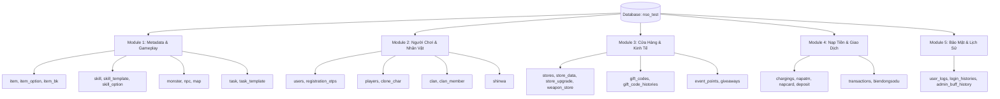

# TÀI LIỆU TOÀN DIỆN VỀ CƠ SỞ DỮ LIỆU & HƯỚNG DẪN CÂN BẰNG GAME NSO

> **Phiên bản máy chủ**: NSO Ninja School Private 2026  
> **Hệ quản trị**: MariaDB 10.6+ / MySQL 8.0+ (`nso_test`)  
> **Tổng số bảng**: 66 Bảng dữ liệu

---

## MỤC LỤC
1. [Sơ Đồ & Phân Loại Cấu Trúc Cơ Sở Dữ Liệu](#1-sơ-đồ--phân-loại-cấu-trúc-cơ-sở-dữ-liệu)
2. [Chi Tiết Các Bảng Dữ Liệu Trọng Tâm](#2-chi-tiết-các-bảng-dữ-liệu-trọng-tâm)
3. [Hướng Dẫn Hiệu Chỉnh Tỷ Lệ & Cân Bằng Game](#3-hướng-dẫn-hiệu-chỉnh-tỷ-lệ--cân-bằng-game)
   - [3.1. Chỉnh Tỷ Lệ EXP, Level Max & Tốc Độ Luyện Cấp](#31-chỉnh-tỷ-lệ-exp-level-max--tốc-độ-luyện-cấp)
   - [3.2. Chỉnh Tỷ Lệ Đập Đồ (Nâng Cấp Vũ Khí & Trang Bị)](#32-chỉnh-tỷ-lệ-đập-đồ-nâng-cấp-vũ-khí--trang-bị)
   - [3.3. Cân Bằng Máu & Sức Mạnh Quái Vật, Boss](#33-cân-bằng-máu--sức-mạnh-quái-vật-boss)
   - [3.4. Cân Bằng Sát Thương & Hiệu Ứng Kỹ Năng 6 Phái](#34-cân-bằng-sát-thương--hiệu-ứng-kỹ-năng-6-phái)
   - [3.5. Hiệu Chỉnh Cửa Hàng NPC & Giá Bán (Xu, Lượng, Yên)](#35-hiệu-chỉnh-cửa-hàng-npc--giá-bán-xu-lượng-yên)
   - [3.6. Cân Bằng Kinh Tế, Chợ Shinwa & Giao Dịch](#36-cân-bằng-kinh-tế-chợ-shinwa--giao-dịch)
4. [Bảng Tra Cứu Mã Option Chỉ Số Trang Bị (ItemOption ID)](#4-bảng-tra-cứu-mã-option-chỉ-số-trang-bị-itemoption-id)

---

## 1. SƠ ĐỒ & PHÂN LOẠI CẤU TRÚC CƠ SỞ DỮ LIỆU

Toàn bộ 66 bảng trong Database `nso_test` được chia thành **5 nhóm module** chức năng:



---

## 2. CHI TIẾT CÁC BẢNG DỮ LIỆU TRỌNG TÂM

### A. Nhóm Quản Trị Tài Khoản & Nhân Vật

#### 1. Bảng `users` (Tài khoản người dùng)
* **`id`**: Khóa chính.
* **`username`**: Tên đăng nhập (chữ cái/số, không dấu).
* **`password`**: Mật khẩu đã băm bằng **BCrypt Cost 12** (`$2a$12$...`).
* **`role`**: Phân quyền (`0`: Thành viên, `1`: Quản trị viên Admin).
* **`status`**: Trạng thái tài khoản (`0`: Bình thường, `1`: Khóa tài khoản).
* **`online`**: `1` nếu đang đăng nhập trong game, `0` nếu offline.
* **`luong`**, **`balance`**, **`tongnap`**: Số dư Lượng web, tiền tệ và tích lũy nạp.

#### 2. Bảng `players` (Hồ sơ nhân vật Ninja)
* **`id`**: ID nhân vật.
* **`user_id`**: Liên kết tài khoản trong bảng `users`.
* **`name`**: Tên nhân vật hiển thị trong game (tối đa 15 ký tự).
* **`class`**: Môn phái (`0`: Chưa nhập học, `1`: Kiếm, `2`: Tiêu, `3`: Kunai, `4`: Cung, `5`: Đao, `6`: Quạt).
* **`potential`**: Chuỗi mảng `[Sức khỏe, Thân pháp, Thể lực, Chakra]`.
* **`point`**: Điểm tiềm năng chưa cộng.
* **`spoint`**: Điểm kỹ năng chưa cộng.
* **`skill`**: Chuỗi JSON lưu danh sách kỹ năng đã học kèm cấp độ skill.
* **`equiped`**: Chuỗi JSON lưu toàn bộ trang bị đang mặc (kèm dòng chỉ số, cấp cường hóa +1 đến +16).
* **`bag`**, **`box`**: Túi hành trang và Rương đồ cá nhân.
* **`mount`**: Thú cưỡi (Sói, Xích Nhãn Ngân Lang, Xe máy, Vẹt, v.v.).
* **`xu`**, **`yen`**: Tiền tệ trong người vật phẩm.

#### 3. Bảng `registration_otps` (Hàng đợi mã cấp phép)
* **`code`**: Mã 6 chữ số ngẫu nhiên.
* **`expires_at`**: Thời gian hết hạn (mặc định 90 phút).
* **`used`**: `0` = Chưa dùng, `1` = Đã dùng.

---

### B. Nhóm Dữ Liệu Gameplay & Cân Bằng

#### 4. Bảng `monster` (Quái vật & Boss)
* **`id`**: ID của loại quái.
* **`name`**: Tên quái vật (ví dụ: *Ốc sên, Heo rừng, Thằn lằn, Boss Dơi Lửa, Boss Tà Thú*).
* **`level`**: Cấp độ của quái.
* **`hp`**: Lượng máu tối đa của quái vật.
* **`boss`**: `0` = Quái thường, `1` = Tinh anh, `2` = Thủ lĩnh / Boss Thế giới.
* **`speed`**: Tốc độ di chuyển của quái.

#### 5. Bảng `item` (Danh mục vật phẩm mẫu)
* **`id`**: Template ID của vật phẩm.
* **`name`**: Tên trang bị / vật phẩm.
* **`type`**: Loại vật phẩm (`0`: Vũ khí, `1`: Nón, `2`: Dây chuyền, `3`: Bao tay, `4`: Nhẫn, `5`: Áo, `6`: Bội, `7`: Quần, `8`: Giày, `9`: Phù, `10`: Dược phẩm/Đá...).
* **`gender`**: Giới tính trang bị (`0`: Nữ, `1`: Nam, `2`: Cả hai).
* **`level`**: Cấp độ tối thiểu để sử dụng.

#### 6. Bảng `skill` & `skill_template` (Kỹ năng môn phái)
* **`id`**: ID cấp độ kỹ năng.
* **`template_id`**: Liên kết tới bảng `skill_template` (Tên chiêu thức, icon, mô tả).
* **`level`**: Cấp độ nhân vật yêu cầu để nâng cấp chiêu này.
* **`max_fight`**: Số lượng mục tiêu tối đa đánh trúng trong 1 đòn đánh.
* **`mana_use`**: Số lượng MP (Chakra) tiêu hao mỗi lần xuất chiêu.
* **`cooldown`**: Thời gian hồi chiêu tính bằng mili-giây (`ms`). Ví dụ: `3000` = 3 giây.
* **`options`**: Mảng JSON chứa các dòng chỉ số sát thương, tỷ lệ choáng, thiêu đốt, bỏng, v.v.

#### 7. Bảng `store_data` & `weapon_store` (Cửa hàng NPC)
* **`item_id` / `templateId`**: ID trang bị bày bán.
* **`store`**: ID cửa hàng của NPC (NPC Tabemono, NPC Kenshiko, NPC Okanehashi...).
* **`coin` (Xu)**, **`gold` (Lượng)**, **`yen` (Yên)**: Giá bán vật phẩm.
* **`options`**: Các dòng chỉ số cơ bản mặc định khi người chơi mua trang bị.

---

## 3. HƯỚNG DẪN HIỆU CHỈNH TỶ LỆ & CÂN BẰNG GAME

### 3.1. Chỉnh Tỷ Lệ EXP, Level Max & Tốc Độ Luyện Cấp

Tỷ lệ EXP toàn server được cấu hình tập trung trong file [`config.properties`](file:///e:/TT/SETUP_LOCAL/SRC_GAME/config.properties) (trên VM tại `/home/ubuntu/nso-server/config.properties`):

```properties
# 1. Hệ số nhân EXP đánh quái (Mặc định 1x)
# Muốn server cày nhanh x5: sửa thành 5 | Cày nhanh x10: sửa thành 10
game.server.exp=5

# 2. Giới hạn cấp độ tối đa của máy chủ
# -1: Không giới hạn (hoặc mặc định theo bảng cấp độ)
# 130: Khóa cấp tối đa ở Level 130
game.server.maxLV=130
```

> **Sau khi sửa**: Khởi động lại server bằng lệnh: `sudo systemctl restart nso-server.service`.

---

### 3.2. Chỉnh Tỷ Lệ Đập Đồ (Nâng Cấp Vũ Khí & Trang Bị)

1. **Tăng tỷ lệ thành công toàn server**:  
   Trong file `config.properties`:
   ```properties
   # Cộng thêm % tỉ lệ thành công khi đập đồ (Ví dụ +20%)
   game.upgrade.percent.add=20
   ```
2. **Chỉnh sửa chỉ số nhận được khi nâng cấp (+1 đến +16)**:  
   Mở Database và chỉnh sửa bảng **`store_upgrade`**:
   - `upgrade`: Mức cường hóa (+1, +2, ..., +16).
   - `options`: Mảng chỉ số được kích hoạt tương ứng (Ví dụ: +12 tăng tấn công cơ bản, +14 tăng sát thương chí mạng, +16 giảm thời gian bị choáng).

---

### 3.3. Cân Bằng Máu & Sức Mạnh Quái Vật, Boss

Để điều chỉnh quái vật dễ đánh hơn hoặc làm Boss thế giới trở nên thử thách:

1. **Xem thông tin máu của Boss**:
   ```sql
   SELECT id, name, level, hp, boss FROM monster WHERE boss = 1 OR boss = 2;
   ```
2. **Tăng/giảm máu của quái hoặc Boss cụ thể**:
   ```sql
   -- Ví dụ: Tăng máu Boss Tà Thú (ID 112) lên 50.000.000 HP
   UPDATE monster SET hp = 50000000 WHERE id = 112;

   -- Ví dụ: Giảm 30% máu toàn bộ quái vật cấp độ 1-30 để tân thủ dễ làm nhiệm vụ
   UPDATE monster SET hp = ROUND(hp * 0.7) WHERE level BETWEEN 1 AND 30 AND boss = 0;
   ```

---

### 3.4. Cân Bằng Sát Thương & Hiệu Ứng Kỹ Năng 6 Phái

Bảng **`skill`** quyết định sức mạnh của từng chiêu thức:

1. **Giảm thời gian hồi chiêu (Cooldown)**:
   ```sql
   -- Giảm hồi chiêu kỹ năng 7x (Ví dụ template_id = 45) xuống còn 1.5 giây (1500 ms)
   UPDATE skill SET cooldown = 1500 WHERE template_id = 45;
   ```
2. **Tăng số lượng mục tiêu lan (Max Fight)**:
   ```sql
   -- Cho phép chiêu Quạt 6x đánh trúng 7 mục tiêu cùng lúc
   UPDATE skill SET max_fight = 7 WHERE template_id = 58;
   ```
3. **Chỉnh sửa sát thương & tỷ lệ hiệu ứng khống chế (`options`)**:
   Dòng `options` trong `skill` có cấu trúc JSON: `[{"id": option_id, "param": value}]`.
   - `id: 0`: Tấn công ngoại.
   - `id: 1`: Tấn công nội.
   - `id: 45`: Thời gian làm choáng (ms).
   - `id: 43`: Thời gian thiêu đốt.

---

### 3.5. Hiệu Chỉnh Cửa Hàng NPC & Giá Bán (Xu, Lượng, Yên)

Bảng **`store_data`** và **`weapon_store`** quản lý toàn bộ vật phẩm bán trong Làng:

1. **Giảm giá bán bằng Lượng hoặc tăng giá Xu**:
   ```sql
   -- Giảm 50% giá Lượng cho tất cả vật phẩm hỗ trợ trong NPC Tabemono (store = 1)
   UPDATE store_data SET gold = ROUND(gold * 0.5) WHERE store = 1 AND gold > 0;

   -- Chuyển một vật phẩm bán bằng Lượng sang bán bằng Yên (Miễn phí cho cày cuốc)
   UPDATE store_data SET gold = 0, yen = 50000 WHERE item_id = 34; -- Bạch Biến Lệnh
   ```
2. **Chỉnh chiết khấu toàn cửa hàng trong `config.properties`**:
   ```properties
   # Giảm giá tất cả shop 10%
   game.store.discount=10
   ```

---

### 3.6. Cân Bằng Kinh Tế, Chợ Shinwa & Giao Dịch

Trong file `config.properties`:
```properties
# Phí đăng bán vật phẩm lên Chợ Shinwa (Yên)
game.shinwa.fee=50000

# Thuế giao dịch Chợ Shinwa (% khấu trừ khi bán thành công)
game.shinwa.discount=10

# Số vật phẩm tối đa mỗi người được treo trên Shinwa
game.shinwa.player.max=20

# Giới hạn số lần giao dịch trực tiếp giữa 2 người chơi trong ngày
game.trade.limit=10
```

---

## 4. BẢNG TRA CỨU MÃ OPTION CHỈ SỐ TRANG BỊ (`ItemOption ID`)

Khi tạo Giftcode, chỉnh sửa NPC Shop hoặc chỉnh sửa vật phẩm trong Database, sử dụng các mã `Option ID` chuẩn dưới đây:

| Option ID | Tên Chỉ Số | Đơn Vị / Ý Nghĩa |
| :---: | :--- | :--- |
| **0** | Tấn công ngoại công | Điểm cộng thẳng |
| **1** | Tấn công nội công | Điểm cộng thẳng |
| **2** | Kháng Hỏa | Điểm kháng hệ Hỏa |
| **3** | Kháng Băng | Điểm kháng hệ Băng |
| **4** | Kháng Phong | Điểm kháng hệ Phong |
| **5** | Né đòn | Tăng xác suất né tránh |
| **6** | HP Tối Đa | Tăng lượng máu cơ bản |
| **7** | MP Tối Đa | Tăng lượng mana cơ bản |
| **8** | Vật công ngoại công (%) | Tăng % công lực vật lý |
| **9** | Vật công nội công (%) | Tăng % công lực phép |
| **10** | Chính xác | Tăng khả năng đánh trúng |
| **14** | Chí mạng (Crit Rate) | Tăng xác suất nổ chí mạng |
| **15** | Phản đòn cận chiến | % Phản lại sát thương khi bị đánh |
| **16** | Tốc độ di chuyển (%) | Tăng tốc độ chạy |
| **20** | Kháng tất cả | Tăng đồng thời Hỏa, Băng, Phong |
| **21** | Hỏa công ngoại | Sát thương hệ Lửa |
| **23** | Băng sát ngoại | Sát thương hệ Băng (gây chậm) |
| **25** | Phong lôi ngoại | Sát thương hệ Sét (gây choáng) |
| **28** | Tỉ lệ MP tối đa (%) | Tăng % mana tối đa |
| **31** | Tỉ lệ HP tối đa (%) | Tăng % máu tối đa |
| **39** | Sát thương chí mạng (%) | Tăng uy lực khi nổ chí mạng |
| **47** | Giảm trừ sát thương | Giảm sát thương nhận vào |
| **65** | Tăng kinh nghiệm đánh quái (%) | `param / 1000` (x EXP) |
| **104** | Tăng điểm kinh nghiệm | Thêm điểm EXP cố định |
| **137** | Không nhận EXP | Dành cho pet/set đồ treo cấp |

---

## 5. CÁC LƯU Ý KHI THAO TÁC DATABASE & SERVER

1. **Quy tắc bộ nhớ đệm (Cache)**:  
   Server game Java nạp toàn bộ cấu hình `item`, `monster`, `skill`, `store` vào RAM khi khởi động. Do đó:
   > ⚠️ **Mọi thay đổi trong Database chỉ có hiệu lực sau khi khởi động lại Server (`sudo systemctl restart nso-server.service`)**.
2. **Sao lưu trước khi chỉnh sửa lớn**:  
   Luôn chạy file [`VM/backup_db_to_local.bat`](file:///e:/TT/SETUP_LOCAL/SRC_GAME/VM/backup_db_to_local.bat) để tạo 1 bản dump lưu về máy tính trước khi thực hiện các câu lệnh `UPDATE` hàng loạt trên Database.
