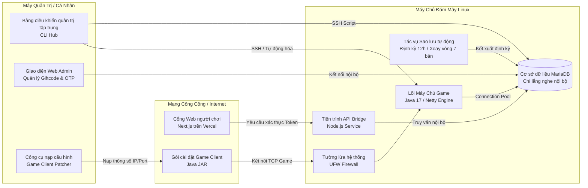

# NSO Game Server — Hồ sơ Dự án (CV & Portfolio)

---

## CV

### NSO Game Server — Hệ sinh thái Vận hành & Hạ tầng Máy chủ Game Cloud
*(Dự án cá nhân / Phi lợi nhuận | Tech stack: Java 17, Netty, MariaDB, Next.js, Node.js, Linux/systemd, PowerShell/Bash)*

Bắt đầu từ mã nguồn máy chủ cộng đồng của tựa game MMORPG tuổi thơ (Ninja School Online) vốn chỉ chạy thử nghiệm cục bộ, dự án tiến hành tái cấu trúc toàn diện và xây dựng hạ tầng Cloud Linux để vận hành một máy chủ game phi lợi nhuận cho cộng đồng bạn bè: từ lõi socket thời gian thực, cổng web đăng ký bảo mật đến quy trình tự động hóa vận hành 1-click.
- **Lõi máy chủ & Mạng thời gian thực (Java Backend / Netty):** Hiện đại hóa mã nguồn Java cũ sang chuẩn Maven/Java 17; tối ưu hóa tầng mạng TCP socket hướng sự kiện (Netty) xử lý kết nối đồng thời, cấu hình connection pool (HikariCP) truy vấn MariaDB hiệu năng cao và xử lý an toàn luồng (concurrency) cho hệ thống phần thưởng / bảo trì định kỳ.
- **Cổng Web & Bảo mật cách ly Database (Next.js / API Bridge):** Phát triển web portal cho người chơi đăng ký và theo dõi trạng thái máy chủ; thiết kế dịch vụ trung gian (API Bridge) cho phép web giao tiếp với cơ sở dữ liệu nội bộ mà vẫn đóng kín 100% cổng cơ sở dữ liệu (Port 3306) với Internet, kết hợp kiểm soát đăng ký bằng mã OTP giới hạn thời gian (90 phút/1 lần dùng).
- **Tự động hóa hạ tầng & Triển khai 1-Click (Cloud DevOps):** Xây dựng bộ công cụ điều khiển tập trung từ máy cá nhân (PowerShell/Bash) tự động hóa toàn bộ vòng đời máy chủ: khởi tạo máy chủ Linux từ đầu (Java 17, MariaDB, 4GB Swap, Firewall), biên dịch và cập nhật bản build mới 1-click lên Cloud VM, giám sát tài nguyên trực tiếp và sao lưu/xoay vòng dữ liệu tự động mỗi 12 giờ.
- **Công cụ Quản trị & Tiện ích Client (Admin Tools & Patcher):** Xây dựng giao diện Web Admin quản lý danh mục vật phẩm/Giftcode trực quan và phát triển công cụ tự động nạp thông số IP/Port vào gói cài đặt game client để phân phối bản chơi linh hoạt.

---

## PORTFOLIO

# NSO Game Server Ecosystem & Cloud Management Hub

Hệ thống quản lý, tự động hóa triển khai trên Cloud VM và cổng thông tin người chơi dành cho máy chủ game MMORPG (Ninja School Online emulator).

---

## Bối cảnh & Mục tiêu dự án

Dự án xuất phát từ sự tò mò và mong muốn trải nghiệm lại tựa game tuổi thơ thông qua việc tự tay thiết lập, tùy biến và vận hành một máy chủ nhỏ phi lợi nhuận cho cộng đồng bạn bè.

Khởi đầu từ một mã nguồn máy chủ cũ được chia sẻ trong cộng đồng vốn chỉ chạy thử nghiệm cục bộ trên máy cá nhân:
- Quá trình biên dịch, khởi chạy phụ thuộc hoàn toàn vào các thao tác thủ công, cấu hình phân tán và cơ sở dữ liệu mẫu chứa nhiều dữ liệu rác.
- Thiếu giải pháp đưa lên máy chủ đám mây, không có cơ chế bảo vệ cơ sở dữ liệu khi mở ra Internet và chưa có cổng đăng ký người chơi an toàn.

Dự án được xây dựng như một hệ sinh thái hoàn chỉnh xoay quanh vòng đời của một dịch vụ game: từ tái cấu trúc mã nguồn máy chủ, thiết lập hạ tầng đám mây Linux, thiết kế giải pháp bảo mật dữ liệu, cho đến tự động hóa toàn bộ quy trình vận hành với chi phí tài nguyên tối thiểu.

---

## Những thách thức & Vấn đề cần giải quyết

1. **Trải nghiệm vận hành thực tế:** Thiết lập quy trình quản trị toàn trình từ máy cá nhân lên máy chủ đám mây với giao diện điều khiển tập trung, dễ sử dụng.
2. **Triển khai và cập nhật tự động:** Khởi tạo máy chủ Linux mới từ trạng thái sạch hoàn toàn mà không cần cấu hình thủ công từng bước; hỗ trợ cập nhật phiên bản mới nhanh chóng với thời gian gián đoạn tối thiểu.
3. **Bảo vệ cơ sở dữ liệu trước rủi ro mạng:** Cung cấp tính năng đăng ký tài khoản qua nền tảng web công khai nhưng tuyệt đối không được mở cổng cơ sở dữ liệu ra ngoài Internet.
4. **Kiểm soát quy mô và bảo đảm tính riêng tư:** Ngăn chặn tình trạng tạo tài khoản rác tràn lan thông qua cơ chế cấp quyền có kiểm soát từ quản trị viên.
5. **An toàn dữ liệu người chơi:** Thiết lập hệ thống sao lưu tự động nhiều tầng nhằm phòng ngừa rủi ro mất mát dữ liệu do sự cố máy chủ.
6. **Linh hoạt cấu hình cho người chơi:** Tự động hóa việc nạp địa chỉ máy chủ vào gói cài đặt game client để người chơi dễ dàng kết nối mà không cần chỉnh sửa thủ công.

---

## Kiến trúc & Luồng hoạt động hệ thống

Hệ thống được tổ chức thành 4 phân hệ chính:

### 1. Bảng điều khiển quản trị tập trung (Management Hub)
- Trung tâm điều khiển toàn bộ thao tác vận hành từ máy cá nhân thông qua giao diện dòng lệnh menu trực quan.
- Điều phối toàn bộ quy trình: kiểm tra môi trường lập trình, tự động cài đặt máy chủ đám mây mới từ xa, biên dịch và triển khai 1-click, mở cổng kết nối SSH, theo dõi hiệu năng phần cứng (CPU, RAM, Disk, Uptime) và đồng bộ bản sao lưu về máy cá nhân.

### 2. Cổng Web người chơi & Tiến trình API Bridge
- **Cổng thông tin người chơi:** Ứng dụng web xây dựng trên nền tảng Next.js, cung cấp giao diện đăng ký tài khoản, theo dõi tình trạng hoạt động của máy chủ (Online/Bảo trì, số lượng người chơi trực tuyến) và tra cứu danh sách quà tặng.
- **Tiến trình API Bridge bảo mật:** Một dịch vụ nền chạy độc lập trên máy chủ Linux, đóng vai trò là "cầu nối" duy nhất tiếp nhận các yêu cầu từ trang web và truy vấn dữ liệu vào cơ sở dữ liệu nội bộ.

### 3. Công cụ quản trị nghiệp vụ (Admin Web Portal)
- Giao diện web cục bộ dành riêng cho quản trị viên để tạo, quản lý và phân phối Giftcode.
- Tích hợp sẵn danh mục tra cứu vật phẩm trực quan, hỗ trợ thiết lập số lượng, thuộc tính trang bị, hạn sử dụng và tự động dọn dẹp các bản ghi liên quan trong cơ sở dữ liệu khi xóa mã.

### 4. Lõi máy chủ Game & Tiện ích Client
- **Lõi máy chủ:** Ứng dụng backend Java hiện đại hóa sử dụng mô hình mạng hướng sự kiện (Netty) để xử lý kết nối TCP socket đồng thời, kết hợp bộ quản lý kết nối cơ sở dữ liệu (HikariCP) và hệ thống lập lịch tác vụ nền (Quartz Scheduler).
- **Tiện ích Client:** Bộ công cụ can thiệp trực tiếp vào luồng dữ liệu cấu hình của gói cài đặt game client, giúp thay đổi địa chỉ IP và cổng máy chủ đích nhanh chóng.

---

## Những quyết định kỹ thuật & Giải pháp thực tế

### Triết lý thiết kế: Tinh gọn, tối ưu chi phí và ưu tiên tính riêng tư
Vì mục tiêu là vận hành một máy chủ nhỏ phi lợi nhuận phục vụ học hỏi và giải trí, các giải pháp kỹ thuật đều bám sát tiêu chí:
- Tối ưu hóa hiệu năng để chạy mượt mà trên gói máy chủ đám mây cấu hình cơ bản mà không phát sinh chi phí.
- Thu hẹp tối đa bề mặt rủi ro bảo mật mà không phụ thuộc vào các dịch vụ bên thứ ba tốn phí.
- Thiết kế cơ chế cấp phát tài khoản có chủ đích nhằm giữ môi trường chơi game riêng tư và thân thiện.

### 1. Kiến trúc Zero Open Port cho Cơ sở dữ liệu
- **Vấn đề:** Trang web người chơi cần đọc và ghi dữ liệu tài khoản vào cơ sở dữ liệu trên máy chủ đám mây. Nếu mở công khai cổng kết nối cơ sở dữ liệu (Port 3306) ra Internet, hệ thống sẽ đối mặt với nguy cơ bị quét cổng tự động và tấn công dò mật khẩu.
- **Giải pháp:** Cơ sở dữ liệu được cấu hình chỉ lắng nghe trên mạng nội bộ và bị tường lửa chặn hoàn toàn khỏi Internet. Mọi giao tiếp từ trang web đều phải đi qua tiến trình API Bridge trung gian với mã token bí mật trong tiêu đề yêu cầu HTTP. Mô hình này cũng cho phép đặt trang web phía sau mạng phân phối Cloudflare để che giấu hoàn toàn địa chỉ IP thật của máy chủ.

### 2. Kiểm soát tạo tài khoản bằng mã xác thực một lần (OTP) có thời hạn
- **Vấn đề:** Tránh việc người lạ hoặc công cụ tự động đăng ký tài khoản hàng loạt mà không cần sử dụng hệ thống SMS/Email tốn kém.
- **Giải pháp:** 
  - Hệ thống chỉ cho phép tạo tài khoản khi người chơi cung cấp một mã xác thực 6 chữ số do quản trị viên tạo ra từ máy chủ.
  - Mỗi mã OTP chỉ có hiệu lực một lần duy nhất, tự động hết hạn sau 90 phút và lập tức bị vô hiệu hóa ngay khi tài khoản được tạo thành công.
  - Mật khẩu người dùng được mã hóa bằng thuật toán BCrypt với độ phức tạp phù hợp, đảm bảo an toàn tuyệt đối và tương thích hoàn toàn với lõi game server.

### 3. Chiến lược sao lưu kép và xoay vòng dữ liệu tự động
- **Vấn đề:** Cần phòng ngừa sự cố mất dữ liệu nhưng không được để các file sao lưu tích tụ làm đầy dung lượng ổ cứng máy chủ.
- **Giải pháp:** 
  - **Tầng tự động trên máy chủ:** Tác vụ định kỳ chạy mỗi 12 giờ tự động kết xuất toàn bộ dữ liệu, nén lại và áp dụng chính sách xoay vòng lưu trữ tối đa 7 bản (tự động xóa bản cũ nhất khi đầy).
  - **Tầng chủ động về máy cá nhân:** Bảng điều khiển quản trị tích hợp chức năng tải bản sao lưu mới nhất về máy tính qua kết nối mã hóa SSH bất cứ lúc nào mà không làm ảnh hưởng đến tiến trình sao lưu định kỳ trên máy chủ.

### 4. Quy trình đóng gói và khởi tạo máy chủ 1-Click
- **Vấn đề:** Việc cấu hình thủ công một máy chủ đám mây mới thường tốn nhiều thời gian và dễ phát sinh lỗi (thiếu bộ nhớ ảo, sai múi giờ, quyền hạn dịch vụ).
- **Giải pháp:** Xây dựng kịch bản tự động hóa toàn trình:
  - Tự động nhận diện hệ điều hành, cập nhật phần mềm và thiết lập múi giờ chuẩn.
  - Khởi tạo 4GB không gian bộ nhớ ảo (Swap) giúp máy chủ không bị tràn bộ nhớ khi tải đột biến.
  - Tự động cài đặt môi trường Java, cơ sở dữ liệu, nạp cấu trúc bảng sạch và đồng bộ tài nguyên game.
  - Cấu hình các dịch vụ hệ thống tự động khởi động cùng máy chủ và tự phục hồi khi gặp sự cố.

---

## Cải tiến & Tối ưu hóa lõi Game Server

Trong quá trình đưa mã nguồn lên hạ tầng đám mây, phần lõi máy chủ Java đã được tái cấu trúc và hoàn thiện:
- **Chuẩn hóa môi trường cấu hình:** Phân tách rõ ràng giữa cấu hình chạy thử nghiệm trên máy cá nhân và cấu hình vận hành chính thức trên máy chủ đám mây.
- **Xử lý đồng thời & Quà tặng:** Tái cấu trúc module phát quà và mã thưởng nhằm đảm bảo an toàn luồng khi có nhiều người chơi cùng nhận thưởng một lúc.
- **Hệ thống nhân vật máy (AI Bot):** Hoàn thiện logic điều khiển và sinh nhân vật ảo trên các khu vực bản đồ nhằm tạo sự sống động cho thế giới game.
- **Lập lịch bảo trì an toàn:** Xây dựng cơ chế tự động lưu dữ liệu người chơi và ngắt kết nối an toàn trước khi máy chủ tiến hành các chu kỳ bảo trì định kỳ.
- **Giải mã công thức trò chơi:** Nghiên cứu và tài liệu hóa toàn bộ cơ chế tính toán sát thương, thuộc tính đối kháng và bảng chỉ số 162 dòng trang bị nhằm phục vụ việc cân bằng hệ thống lâu dài.

---

## Hiện trạng & Định hướng phát triển

### Hiện trạng:
- Toàn bộ hạ tầng máy chủ đám mây, tiến trình bảo mật và cổng thông tin người chơi đang hoạt động ổn định với quy trình quản lý 1-click từ máy cá nhân.
- Hệ thống dữ liệu, bảng chỉ số chiến đấu và kỹ năng các môn phái đã được chuẩn hóa và tài liệu hóa chi tiết.

### Định hướng tiếp theo:
- Can thiệp sâu hơn vào các lớp logic gameplay (cân bằng lại sức mạnh kỹ năng môn phái, tinh chỉnh tỷ lệ rơi vật phẩm và thiết kế sự kiện mới).
- Tiếp tục duy trì và hoàn thiện hệ thống để vận hành ổn định như một sân chơi cộng đồng phi lợi nhuận lâu dài.
